<div align="center">

# 🧮 Programmer Calculator

### *Master Number Systems with Elegance & Precision*


**A comprehensive tool for computer science students and professionals to explore binary, octal, decimal, and hexadecimal number systems with precision and ease.**

</div>

---

## 🎬 Live Conversion Animation

```mermaid
sequenceDiagram
    autonumber
    participant User as 👤 User
    participant Input as 📥 Input System
    participant Binary as 💚 Binary Engine
    participant Octal as 🧡 Octal Engine
    participant Decimal as 💙 Decimal Engine
    participant Hex as 💜 Hex Engine
    participant Output as 📤 Output Display
    
    User->>Input: Enter Number "42"
    Note over Input: Validating...
    Input->>Decimal: Decimal Input Detected
    
    par Parallel Conversion
        Decimal->>Binary: Convert to Binary
        Note over Binary: 42₁₀ → 101010₂
        Binary-->>Output: 101010
    and
        Decimal->>Octal: Convert to Octal
        Note over Octal: 42₁₀ → 52₈
        Octal-->>Output: 52
    and
        Decimal->>Hex: Convert to Hexadecimal
        Note over Hex: 42₁₀ → 2A₁₆
        Hex-->>Output: 2A
    end
    
    Output->>User: Display All Results ✨
    
    rect rgb(102, 126, 234)
    Note over User,Output: ⚡ Lightning Fast Conversion < 1ms
    end
```



---

## 🔄 Real-Time Number System Flow

```mermaid
graph LR
    subgraph INPUT["📥 INPUT"]
        A[User Input<br/>Any Base]
    end
    
    subgraph CONVERSION["🔄 CONVERSION HUB"]
        B[Binary 2️⃣]
        C[Octal 8️⃣]
        D[Decimal 🔟]
        E[Hex 1️⃣6️⃣]
    end
    
    subgraph OUTPUT["📤 OUTPUT"]
        F[All Formats<br/>Displayed]
    end
    
    A -->|Parse| B
    A -->|Parse| C
    A -->|Parse| D
    A -->|Parse| E
    
    B <-->|Convert| C
    B <-->|Convert| D
    B <-->|Convert| E
    C <-->|Convert| D
    C <-->|Convert| E
    D <-->|Convert| E
    
    B -->|Result| F
    C -->|Result| F
    D -->|Result| F
    E -->|Result| F
    
    style A fill:#667eea,stroke:#fff,stroke-width:4px,color:#fff
    style B fill:#43e97b,stroke:#fff,stroke-width:3px,color:#fff
    style C fill:#f093fb,stroke:#fff,stroke-width:3px,color:#fff
    style D fill:#4facfe,stroke:#fff,stroke-width:3px,color:#fff
    style E fill:#fa709a,stroke:#fff,stroke-width:3px,color:#fff
    style F fill:#ffecd2,stroke:#333,stroke-width:4px,color:#333
    style INPUT fill:#1e3c72,stroke:#fff,stroke-width:4px
    style CONVERSION fill:#2a5298,stroke:#fff,stroke-width:4px
    style OUTPUT fill:#0f2027,stroke:#fff,stroke-width:4px
```



---

## ⚡ Feature Showcase Animation

```mermaid
timeline
    title 🚀 Development Timeline & Features
    
    2024-Q1 : 🎯 Core Development
            : Binary Conversion
            : Octal Conversion
            : Basic Arithmetic
    
    2024-Q2 : 🔧 Advanced Features
            : Fractional Support
            : Signed Numbers
            : 1's & 2's Complement
    
    2024-Q3 : 🎨 UI Enhancement
            : Swing GUI
            : Multi-tab Interface
            : Real-time Validation
    
    2024-Q4 : ✨ Polish & Release
            : Testing Suite
            : Documentation
            : v1.0.0 Launch
    
    2025-Future : 🔮 Upcoming
                : IEEE 754 Support
                : Dark Mode
                : Web Version
```



---

<div align="center">

<p align="center">
  <a href="#-features">Features</a> •
  <a href="#-quick-start">Quick Start</a> •
  <a href="#-user-guide">Documentation</a> •
  <a href="#-architecture">Architecture</a> •
  <a href="#-contributing">Contributing</a>
</p>

</div>

---

## 📖 Table of Contents

- [Overview](#-overview)
- [Features](#-features)
- [Quick Start](#-quick-start)
- [User Guide](#-user-guide)
- [Architecture](#-architecture)
- [API Reference](#-api-reference)
- [Development](#-development)
- [Educational Resources](#-educational-resources)
- [Contributing](#-contributing)
- [License](#-license)

---

## 🎯 Overview

The **Programmer Calculator** is a sophisticated Java application designed to demystify number system operations. Built for the CSC212 curriculum, it combines theoretical computer science with practical computation, offering an intuitive interface for complex multi-base operations.

### Why This Calculator?

- **🎓 Educational Focus** - Learn by doing with real-time visual feedback
- **💼 Professional Tool** - Handle complex conversions in production environments
- **🔧 Developer Friendly** - Clean architecture for easy extension and modification
- **📚 Well Documented** - Comprehensive guides for learning and implementation

### At a Glance

```
┌─────────────────────────────────────────────────────────────┐
│  Binary (Base-2)  ←→  Octal (Base-8)  ←→  Decimal (Base-10) │
│                    ↕                    ↕                     │
│                  Hexadecimal (Base-16)                       │
│                                                               │
│  • Arithmetic Operations    • Signed Number Support          │
│  • Fractional Conversion    • 1's & 2's Complement           │
└─────────────────────────────────────────────────────────────┘
```

---

## ✨ Features

<table>
<tr>
<td width="50%">

### 🔄 Universal Conversion Engine

Convert seamlessly between all major number systems:

- **Binary** ↔️ Octal, Decimal, Hexadecimal
- **Octal** ↔️ Binary, Decimal, Hexadecimal  
- **Decimal** ↔️ Binary, Octal, Hexadecimal
- **Hexadecimal** ↔️ Binary, Octal, Decimal

**Supports:**
- Integer conversions
- Fractional numbers (e.g., `1010.101₂`)
- Precision up to 10 decimal places
- Negative numbers

</td>
<td width="50%">

### 🧮 Multi-Base Arithmetic

Perform operations in any base:

| Operation | Support |
|-----------|---------|
| Addition | ✅ All Bases |
| Subtraction | ✅ All Bases |
| Multiplication | ✅ All Bases |
| Division | ✅ All Bases |

**Features:**
- Step-by-step breakdown
- Carry/borrow visualization
- Result validation
- Error detection

</td>
</tr>
</table>

### 🎯 Advanced Features

<details>
<summary><b>Signed Number Operations</b></summary>

Master signed binary arithmetic:

- **1's Complement** - Addition and subtraction
- **2's Complement** - Addition and subtraction
- **Sign Extension** - Automatic bit width handling
- **Overflow Detection** - Visual alerts for arithmetic overflow
- **Range Validation** - Ensures valid signed number ranges

```
Example: 2's Complement Addition
  0001 0110 (22₁₀)
+ 1111 0101 (-11₁₀)
-----------
  0000 1011 (11₁₀)
```

</details>

---

## 🏗️ Architecture

<div align="center">

### 🎯 System Architecture Visualization

</div>


### 📊 Feature Distribution & Statistics

<div align="center">

#### Supported Operations by Base

```
           Binary    Octal    Decimal    Hexadecimal
           ┌────┐   ┌────┐    ┌────┐      ┌────┐
Addition   │ ██ │   │ ██ │    │ ██ │      │ ██ │  100%
Subtract   │ ██ │   │ ██ │    │ ██ │      │ ██ │  100%
Multiply   │ ██ │   │ ██ │    │ ██ │      │ ██ │  100%
Division   │ ██ │   │ ██ │    │ ██ │      │ ██ │  100%
           └────┘   └────┘    └────┘      └────┘
```

#### Code Composition

```
                    Total Lines: 2,500
     ┌─────────────────────────────────────────────┐
     │████████████░░░░░░░░░░░░░░░░░░░░░░░░░░░░░░░│ 45% Business Logic (1,125 lines)
     │█████████░░░░░░░░░░░░░░░░░░░░░░░░░░░░░░░░░│ 35% GUI Components (875 lines)
     │████░░░░░░░░░░░░░░░░░░░░░░░░░░░░░░░░░░░░░│ 15% Utilities (375 lines)
     │█░░░░░░░░░░░░░░░░░░░░░░░░░░░░░░░░░░░░░░░░│  5% Testing (125 lines)
     └─────────────────────────────────────────────┘
```

#### Test Coverage by Module

```
Conversion Engine    ████████████████████  95% ✓
Arithmetic Engine    ███████████████████░  90% ✓
Signed Number Engine ██████████████████░░  85% ✓
GUI Components       ████████████░░░░░░░░  60% ⚠
Utilities            ████████████████████  98% ✓
                     └─────────────────┘
                     0%              100%
```

</div>

### 🎨 Colorful Component Architecture

```mermaid
graph LR
    subgraph PACKAGES["📦 Package Structure"]
        GUI["🎨 gui/<br/>UI Components"]
        CONV["🔄 conversion/<br/>Base Converters"]
        ARITH["🧮 arithmetic/<br/>Operations"]
        SIGN["⚡ signed/<br/>Complement Logic"]
        UTIL["🛠️ utils/<br/>Helpers"]
    end
    
    GUI --> CONV
    GUI --> ARITH
    GUI --> SIGN
    CONV --> UTIL
    ARITH --> UTIL
    SIGN --> UTIL
    
    style GUI fill:#ff6b6b,stroke:#333,stroke-width:3px,color:#fff
    style CONV fill:#4ecdc4,stroke:#333,stroke-width:3px,color:#fff
    style ARITH fill:#45b7d1,stroke:#333,stroke-width:3px,color:#fff
    style SIGN fill:#f7b731,stroke:#333,stroke-width:3px,color:#fff
    style UTIL fill:#5f27cd,stroke:#333,stroke-width:3px,color:#fff
    style PACKAGES fill:#2d3436,stroke:#fff,stroke-width:4px
```



### 🔄 Animated Data Flow


### 🎯 Interactive Component Map

```mermaid
mindmap
  root((🧮 Calculator))
    🎨 UI Layer
      Main Window
      Tab Panels
      Input Fields
      Result Display
    🔧 Business Logic
      Conversion Engine
        Binary Ops
        Octal Ops
        Decimal Ops
        Hex Ops
      Arithmetic Engine
        Addition
        Subtraction
        Multiplication
        Division
      Signed Engine
        1s Complement
        2s Complement
        Overflow Check
    🛠️ Utilities
      Validators
      Parsers
      Formatters
      Error Handlers
```



### ⚡ Processing Pipeline

```mermaid
flowchart LR
    A[📥 Input] --> B{✅ Valid?}
    B -->|Yes| C[🔍 Parse]
    B -->|No| Z[❌ Error Alert]
    C --> D[🔄 Convert]
    D --> E[🎨 Format]
    E --> F[📤 Output]
    F --> G[✨ Success!]
    
    style A fill:#667eea,stroke:#333,stroke-width:3px,color:#fff
    style B fill:#f093fb,stroke:#333,stroke-width:3px,color:#fff
    style C fill:#4facfe,stroke:#333,stroke-width:3px,color:#fff
    style D fill:#43e97b,stroke:#333,stroke-width:3px,color:#fff
    style E fill:#fa709a,stroke:#333,stroke-width:3px,color:#fff
    style F fill:#ffecd2,stroke:#333,stroke-width:3px,color:#333
    style G fill:#38f9d7,stroke:#333,stroke-width:4px,color:#333
    style Z fill:#ff6b6b,stroke:#333,stroke-width:3px,color:#fff
```



### 🧩 Class Hierarchy


---

## 🚀 Quick Start

### Prerequisites

```bash
Java Development Kit (JDK) 8 or higher
Any Java IDE or command line environment
```

### Installation

**Option 1: Clone and Run**

```bash
# Clone the repository
git clone https://github.com/yourusername/programmer-calculator.git

# Navigate to directory
cd programmer-calculator

# Compile
javac -d bin src/**/*.java

# Run
java -cp bin Main
```

**Option 2: Using IDE**

1. Open your IDE (Eclipse, IntelliJ IDEA, NetBeans)
2. Import as Java project
3. Build project
4. Run `Main.java`

**Option 3: Download JAR**

```bash
# Download latest release
wget https://github.com/yourusername/programmer-calculator/releases/latest/calculator.jar

# Run
java -jar calculator.jar
```

---

## 📘 User Guide

### Basic Conversion

**Step-by-Step Example:**

```
Task: Convert Decimal 42.5 to Binary

1. Select "Conversion" tab
2. Source Base: Decimal
3. Input: 42.5
4. Target Base: Binary
5. Click "Convert"
6. Result: 101010.1
```

### Arithmetic Operations

**Example: Binary Addition**

```
Task: Add 1010₂ + 1100₂

1. Select "Arithmetic" tab
2. Operation: Addition (+)
3. Base: Binary
4. First Number: 1010
5. Second Number: 1100
6. Click "Calculate"
7. Result: 10110

Breakdown:
    1010
  + 1100
  ------
   10110
```

---

## 🔌 API Reference

### Core Classes

#### BaseConverter

```java
public class BaseConverter {
    /**
     * Converts a number from one base to another
     * @param number The input number as string
     * @param fromBase Source base (2, 8, 10, 16)
     * @param toBase Target base (2, 8, 10, 16)
     * @return Converted number as string
     * @throws InvalidNumberException if input is invalid
     */
    public static String convert(String number, int fromBase, int toBase)
        throws InvalidNumberException;
}
```

---

## 💻 Development

### Project Structure

```
programmer-calculator/
├── src/
│   ├── main/
│   │   └── java/
│   │       ├── Main.java
│   │       ├── gui/
│   │       ├── conversion/
│   │       ├── arithmetic/
│   │       ├── signed/
│   │       └── utils/
│   └── test/
├── docs/
├── README.md
└── LICENSE
```

---

## 📚 Educational Resources

### Number Systems Hierarchy


---

## 🤝 Contributing

We welcome contributions! Here's how to get involved:

### Getting Started

1. **Fork** the repository
2. **Clone** your fork
3. **Create** a branch: `git checkout -b feature/amazing-feature`
4. **Make** your changes
5. **Test** thoroughly
6. **Commit**: `git commit -m 'Add amazing feature'`
7. **Push**: `git push origin feature/amazing-feature`
8. **Open** a Pull Request

---

## 📄 License

This project is licensed under the **MIT License**.

---

## 👥 Authors & Acknowledgments

### Lead Developer

**Luthando Candlovu**

### Special Thanks

- **CSC212 Course Staff** - Guidance and curriculum support
- **Open Source Community** - Java libraries and tools
- **Beta Testers** - Valuable feedback and bug reports

---

<div align="center">

## ⭐ Star This Project

**If you find this calculator useful, give it a star!**

[](https://github.com/yourusername/programmer-calculator/stargazers)

---

### Made with ❤️ by Luthando Candlovu

*Empowering the next generation of computer scientists, one calculation at a time.*

**[⬆ Back to Top](#-programmer-calculator)**

</div>
